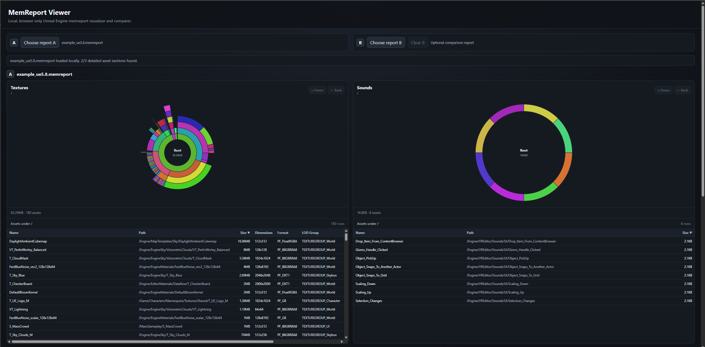
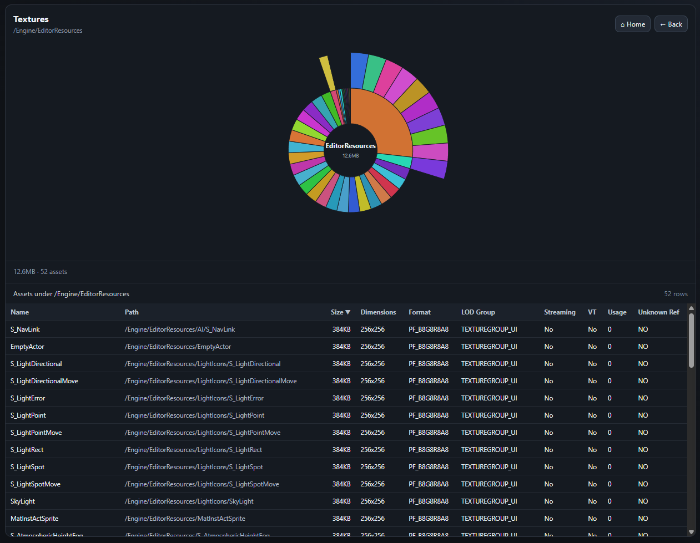
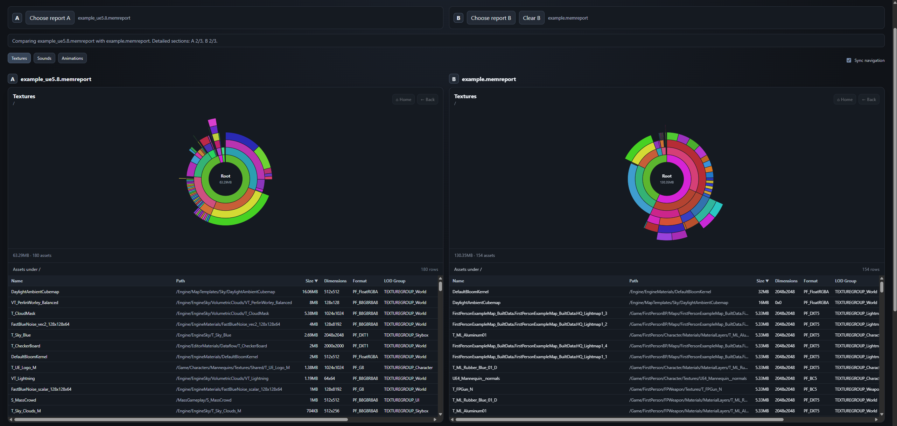
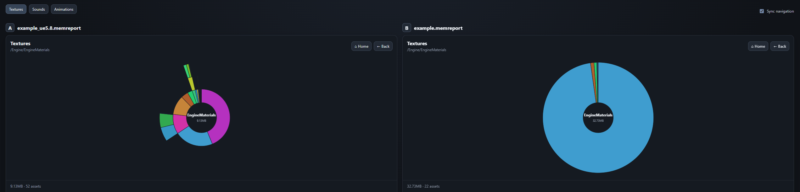
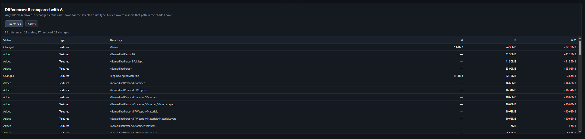

# MemReport Tool

A browser-based Unreal Engine `.memreport` visualizer and comparison tool.

The current application runs entirely in the browser: select one report to explore its memory usage, or select two reports to compare builds and drill into what changed. Reports are read locally and are not uploaded anywhere.

## Features

### Local, dependency-free browser application

- Opens `.memreport` files directly from disk using the browser file picker.
- Reads report contents locally in the browser; no upload or backend is required.
- Parses the detailed texture, sound-wave, and animation-sequence sections independently, so reports can still be inspected when only some detailed sections are available.
- Supports the dynamic `ListTextures` column layouts used by UE4 and UE5 reports rather than assuming a fixed texture column order.



### Interactive memory sunburst charts

Textures, sounds, and animation sequences are grouped by canonical Unreal asset path and displayed as nested donut/sunburst charts.

- Hover a segment to inspect its path, memory size, and available asset details.
- Click a directory segment to drill into that section of the hierarchy.
- Use **Back** to return to the previous navigation location.
- Use **Home** to return directly to the root of the asset hierarchy.
- Breadcrumbs show the path currently being inspected.
- Chart colors are derived deterministically from canonical Unreal paths, making matching directories visually consistent between reports.



### Asset tables

Every visible chart has a table for the assets contained in the currently selected section.

- Assets are sorted by memory size by default.
- Columns are sortable.
- Texture rows retain the metadata available in the memreport, including dimensions, format, LOD group, streaming state, virtual-texture state, usage information, and unknown-reference information when those fields are present.
- Sound-wave and animation-sequence tables expose the fields currently available from their detailed memreport sections.

The table and chart follow the same navigation path, making it possible to use the chart for spatial exploration and the table to identify the largest individual offenders.

## Comparing two reports

Select **Report A** and **Report B** to enter comparison mode. Report A is the baseline and Report B is treated as the newer/target report.

A positive memory delta therefore means that Report B uses more memory than Report A; a negative delta means memory usage decreased.

### Comparison layout and asset-type tabs

When only Report A is loaded, the application uses the available width for the single-report view and hides Report B-specific UI.

When Report B is loaded, the UI switches to comparison mode:

- Report A and Report B are displayed side by side.
- **Textures**, **Sounds**, and **Animations** are exposed as comparison tabs.
- Only the currently selected asset type is shown, keeping both reports aligned and making comparison easier.
- The diff section follows the selected comparison type.



### Synchronized or independent navigation

Comparison mode supports two navigation styles through the **Sync navigation** option.

With synchronization enabled, navigating either report moves both charts to the same canonical path. This is useful when comparing equivalent directories between builds. If a path exists in only one report, the other side intentionally shows that the matching location is missing instead of navigating somewhere unrelated.

With synchronization disabled, Report A and Report B can be explored independently. Each side maintains its own navigation history.

**Back** and **Home** respect the selected navigation mode: in synchronized mode they operate on the pair, while in independent mode they operate only on the selected report.



### Directory and asset diffs

The diff section contains separate **Directories** and **Assets** views and only shows entries that were added, removed, or changed.

Directory comparisons use accumulated memory for matching canonical paths. Asset comparisons use canonical Unreal asset paths.

The diff tables show changes such as:

- directories or assets added in Report B;
- directories or assets removed from Report B;
- memory-size changes;
- texture metadata changes such as dimensions, format/compression, LOD group, and streaming state.

Diff tables are sortable. Clicking a diff row navigates the chart or charts above to the relevant location so the change can immediately be inspected in context. For an asset diff, the matching asset is selected when possible. If the directory or asset exists on only one side, the corresponding side can be empty while the existing side is still shown correctly.



## Running the application

1. Open `web/index.html` in a modern browser.
2. Click **Choose report A** and select a `.memreport` file.
3. Explore the texture, sound, and animation views.
4. Optionally click **Choose report B** and select another `.memreport` file to compare.
5. Use the comparison tabs, navigation controls, and diff tables to inspect changes between the two reports.

Because the application uses browser-local file access, no server process is needed for the current MVP.

## Sample reports

The repository includes sample memreports that can be used to exercise the viewer:

- `sample_reports/example.memreport` — UE4 memreport example.
- `sample_reports/example_simple.memreport` — simplified UE4 memreport example.
- `sample_reports/example_ue5.8.memreport` — UE5.8 memreport example.

## Current architecture

The web implementation is deliberately split by responsibility rather than keeping all behavior in a single application file.

```text
Browser File
    ↓
Report Provider
    ↓
MemReport Parser
    ↓
Report Model / Canonical Paths / Trees
    ↓
Analysis and Diff Queries
    ↓
Application State
    ↓
UI Rendering
```

The main code areas under `web/js/` are:

- `parsing/` — memreport parsing, including textures and generic object-list sections;
- `model/` — report models, canonical path handling, and hierarchy/tree construction;
- `analysis/` — report queries and A/B diff computation;
- `providers/` — acquisition of report data, currently from local browser files;
- `state/` — centralized application state and state transitions;
- `ui/` — reusable table and sunburst rendering;
- `util/` — display and file-size helpers.

`web/app.js` coordinates the application behavior and `web/layout.js` controls the single-report/comparison presentation.

The JavaScript parser is the canonical MemReport parser for the web implementation. Browser `File` objects are kept outside the parsed report model so report acquisition can change without coupling file-system details to the domain model.

## Future server-backed direction

The current MVP is intentionally browser-only, but the architecture leaves room for a later server deployment—for example, a service running near Jenkins and ingesting reports produced by automated tests.

A future server implementation should keep report acquisition separate from repository/storage concerns. Filesystem or Jenkins ingestion will need to account for report/build identity, duplicate ingestion, retries, partially written files, permissions and path security, retention, schema migration, concurrency, and larger historical datasets.

The intended evolution is to add server-side source/repository abstractions and a frontend API-backed report provider rather than putting filesystem paths or persistence responsibilities into the existing parsed report model.

## Browser support and privacy

The application relies on standard modern browser APIs for local file selection and JavaScript rendering. Memreport contents stay in the browser in the current MVP and are not sent to a remote service by this application.
